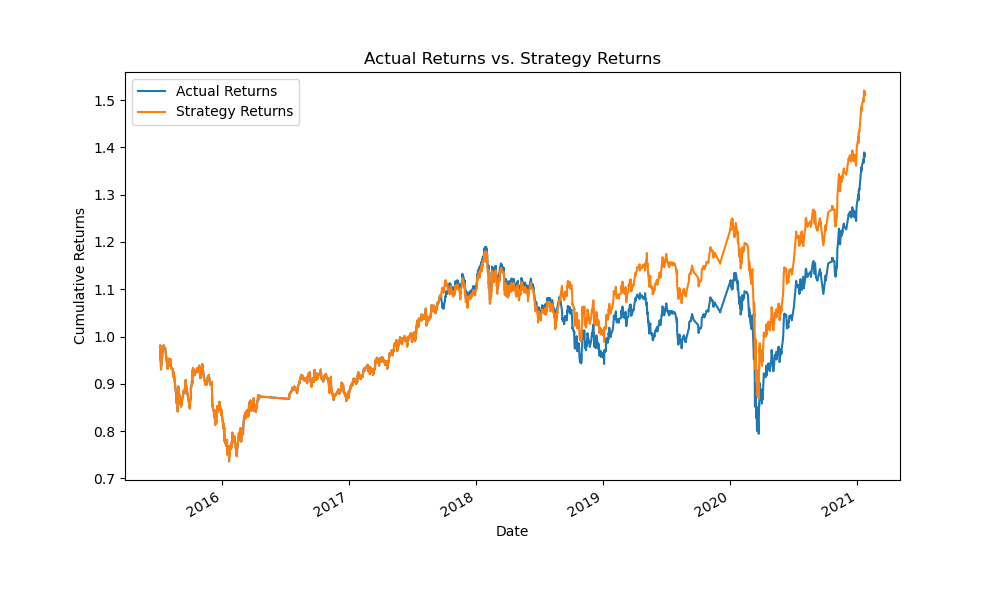
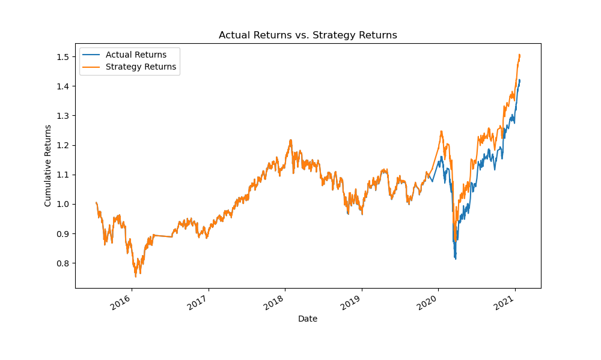
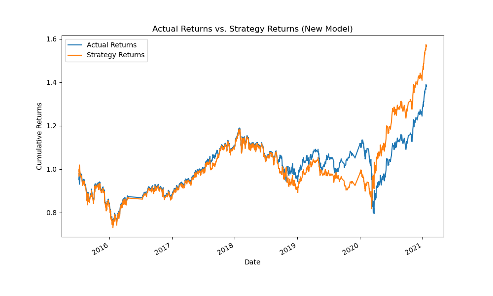

# Tuning the Training Algorithm in Algorithmic Trading

## Introduction
In this section, we explore the effects of tuning the training algorithm by adjusting the size of the training dataset and SMA input. We'll evaluate the performance of the Support Vector Machine (SVM) classifier for different dataset or input.

## Adjusting the Size of the Training Dataset
### Training Period: 2015-04-02 to 2015-05-02
|             | precision | recall | f1-score | support |
|------------ | ----------|--------|----------|---------|
|      -1.0    |    0.37    |   0.03  |   0.06   |   1828  |
|       1.0    |    0.56    |   0.96  |   0.70   |   2324  |
|   accuracy   |            |         |   0.55   |   4152  |
|  macro avg   |    0.47    |   0.49  |   0.38   |   4152  |
| weighted avg |    0.48    |   0.55  |   0.42   |   4152  |

### Training Period: 2015-04-02 to 2015-07-02
|             | precision | recall | f1-score | support |
|------------ | ----------|--------|----------|---------|
|      -1.0    |    0.43    |   0.04  |   0.07   |   1806  |
|       1.0    |    0.56    |   0.96  |   0.71   |   2288  |
|   accuracy   |            |         |   0.55   |   4094  |
|  macro avg   |    0.49    |   0.50  |   0.39   |   4094  |
| weighted avg |    0.50    |   0.55  |   0.43   |   4094  |

### Training Period: 2015-04-02 to 2015-10-02
|             | precision | recall | f1-score | support |
|------------ | ----------|--------|----------|---------|
|      -1.0    |    0.44    |   0.02  |   0.04   |   1733  |
|       1.0    |    0.56    |   0.98  |   0.71   |   2213  |
|   accuracy   |            |         |   0.56   |   3946  |
|  macro avg   |    0.50    |   0.50  |   0.38   |   3946  |
| weighted avg |    0.51    |   0.56  |   0.42   |   3946  |

### Findings:
1. Precision(-1) is inintally very low, indicating that the model misses a significant portion of actual sell signals. As we increase the training window, precision slighty improved.
2. Recall for predicting -1 is also low, indicating that the model misses a significant portion of actual sell signals. 
3. Precision and recall for predicting 1 remain stable.
4. Increasing the training window (i.e., considering a longer historical period) tends to improve the model's ability to predict, leading to higher precision and recall for both classes. 

# Adjusting the SMA Input Features
| Window Sizes | Precision (1) | Recall (1) | F1-Score (1) | Precision (-1) | Recall (-1) | F1-Score (-1) | Accuracy | 
|--------------|---------------|------------|--------------|----------------|-------------|---------------|----------| 
| 4, 100       | 0.56          | 0.96       | 0.71         | 0.43           | 0.04        | 0.07          | 0.55     | 
| 6, 150       | 0.56          | 0.99       | 0.72         | 0.52           | 0.01        | 0.02          | 0.56     | 

### Findings:
1. The recall for predicting buy signals is slightly better in the scenario with window sizes 6, 150, which means that more actual buy signals are captured by the model's predictions.
2. The F1-Score, which balances precision and recall, is higher in the scenario with window sizes 6, 150, indicating a better overall performance for predicting buy signals.
3. For predicting sell signals (-1), the scenario with window sizes 6, 150 performs better in terms of precision, recall, and F1-Score. However, the recall values for predicting sell signals are very low in both scenarios.
4. Overall, the scenario with window sizes 6, 150 seems to perform slightly better. It has a better F1-Score for predicting both buy and sell signals and captures more actual buy signals (higher recall).

## Baseline Model Performance

## Tuned Model Performance

## New Model Performance

## Comparing Model Results
Answer the following questions: 
Did this new model perform better or worse than the provided baseline model? 
Did this new model perform better or worse than your tuned trading algorithm?

1. The new model has slightly better precision and recall for class -1 (selling signals), but worse precision and recall for class 1 (buying signals) compared to the baseline model.
2. The F1-scores and accuracy for both models are relatively similar.
3. The new model seems to outperform the baseline model in terms of strategy returns, as indicated by higher Strategy Returns values in the cumulative_returns_new.tail() data compared to cumulative_returns.tail().

## Conclusions:
- The new model has shown improvements in capturing selling signals compared to the baseline model.
- The new model has also achieved better returns based on the cumulative returns data.
- From previous analysis, the tuned model perform somewhat similar to the baseline model. Which means they both get outperformed by the new model.